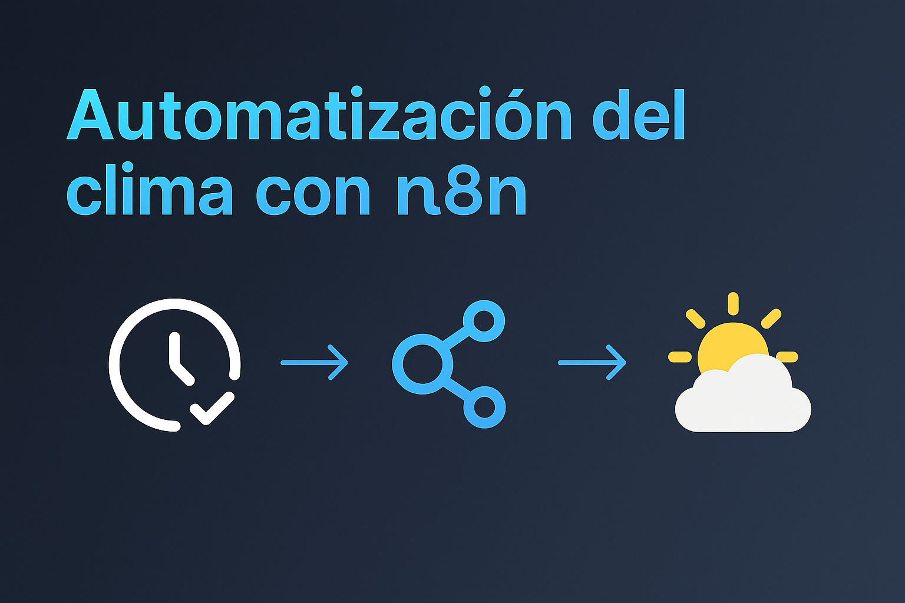

# 🌤 Automatización del Clima con n8n y OpenWeather

Este flujo de **n8n** obtiene el clima actual de Córdoba (Argentina) usando la API de **OpenWeatherMap**, y envía un correo automático todos los días a las 8:00 AM con los datos del tiempo actualizados.

---

## 🚀 Tecnologías utilizadas

- **n8n.io** → Automatización visual sin código  
- **OpenWeatherMap API** → Fuente de datos meteorológicos  
- **Gmail Node** → Envío automático de correos  
- **Cron (Schedule Trigger)** → Ejecución diaria automática  

---

## 🧩 Flujo del Proyecto

[Cron] → [HTTP Request] → [Gmail]

1️⃣ El nodo **Cron** ejecuta el flujo todos los días a las 8 AM.  
2️⃣ El nodo **HTTP Request** consulta la API de OpenWeatherMap.  
3️⃣ El nodo **Gmail** envía un correo con la temperatura, humedad, viento y descripción del clima actual.

---

## 💡 Ejemplo de correo recibido

🌦️ Clima actual en Córdoba
☀️
🌡 Temperatura: 22.3 °C
💧 Humedad: 58 %
🌬 Viento: 12 km/h
📋 Condición: cielo despejado

---

## 🧠 Autor

**Pedro Pérez**  
🎓 Estudiante de Ingeniería en Sistemas – UTN Córdoba  
💻 Desarrollador Backend (Python | Java | n8n)  
🔗 [LinkedIn](https://www.linkedin.com/in/pedro-perez-912716280/)  
🐙 [GitHub](https://github.com/pedrinio10)

---

## 🌍 Inspiración

Proyecto creado para mostrar habilidades de automatización e integración de APIs en n8n, combinando lógica visual, servicios externos y envíos automáticos de correos.
